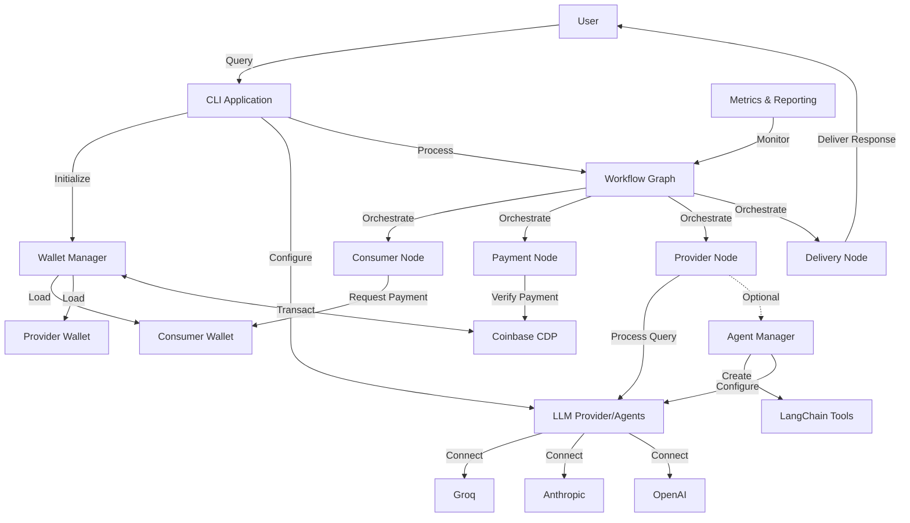
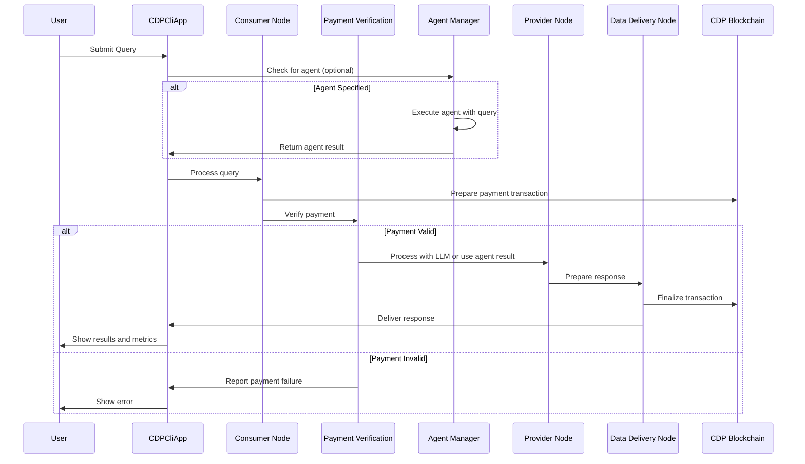
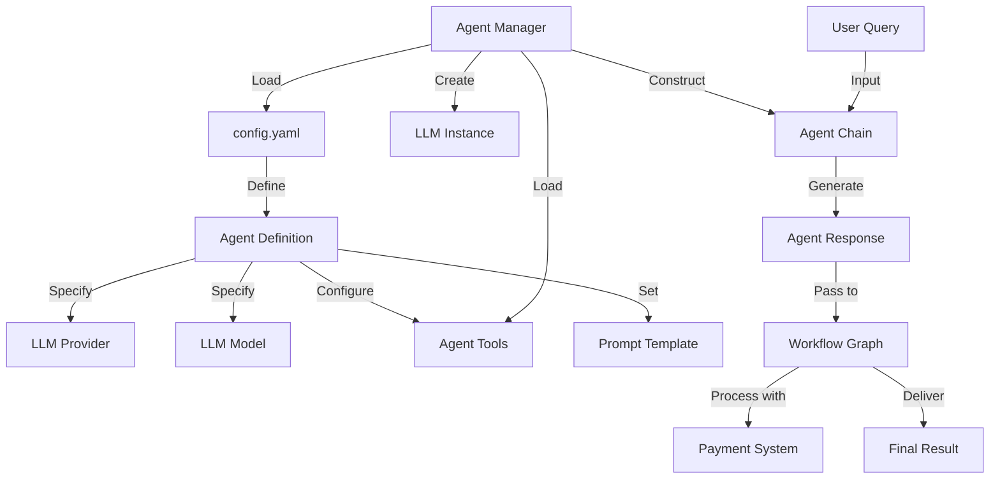

# Payed Agents - Architecture

## System Overview

Payed Agents is a CLI application that implements a pay-per-query interaction model between consumers and AI service providers using the CDP (Coinbase Developer Docs) for secure blockchain-based transactions. The system orchestrates the complete workflow from query submission to payment verification and response delivery.

### System Architecture Diagram



## Component Architecture

### Core Components

1. **CLI Application (`cli/app.py`)**
   - Entry point for the application
   - Handles initialization of all components
   - Manages the query processing workflow
   - Presents results and reports to users

2. **Wallet Management (`core/wallet.py`)**
   - Provides wallet initialization for CDP
   - Manages consumer and provider wallets
   - Handles blockchain interactions

3. **LLM Provider (`core/llm.py`)**
   - Creates and configures LLM instances
   - Manages integration with Groq models
   - Provides abstraction over LLM APIs

4. **Agent Manager (`core/agent_manager.py`)**
   - Creates and manages specialized agents
   - Loads and configures agent tools
   - Executes agent-based queries

5. **Workflow Graph (`workflow/graph.py`)**
   - Implements the workflow using LangGraph
   - Defines the state machine for the payment and response flow
   - Orchestrates the interaction between all nodes

6. **Metrics and Reporting (`core/metrics/`)**
   - Tracks performance metrics
   - Generates monitoring dashboard
   - Records transaction details

### Workflow Nodes

The system uses a directed graph workflow with the following nodes:

1. **Consumer Agent (`workflow/nodes/consumer.py`)**
   - Processes the initial query
   - Prepares payment information
   - Initiates the transaction

2. **Payment Verification (`workflow/nodes/payment.py`)**
   - Verifies that payment is authorized
   - Validates transaction details
   - Routes to success or failure paths

3. **Provider Agent (`workflow/nodes/provider.py`)**
   - Processes the query and generates a response
   - Calculates usage metrics
   - Prepares the data for delivery

4. **Data Delivery (`workflow/nodes/delivery.py`)**
   - Finalizes the transaction
   - Delivers the response to the consumer
   - Records transaction completion

### Configuration

1. **Settings (`config/settings.py`)**
   - Contains LLM configuration
   - Wallet settings
   - Application parameters

2. **Paths (`config/paths.py`)**
   - Manages file paths for the application
   - Validates path existence

3. **Pricing (`config/pricing.py`)**
   - Defines pricing models for different operations
   - Calculates costs based on usage

4. **YAML Config (`config.yaml`)**
   - Defines LLM providers and models
   - Configures agent definitions and tools
   - Sets up wallet and path information

## Data Flow

### Query Processing Workflow



### Agent Integration Flow



## Technologies Used

- **CDP SDK**: Blockchain integration for payments via Coinbase
- **LangChain**: Framework for LLM applications
- **LangGraph**: Workflow orchestration
- **Groq LLM**: AI model provider
- **Python**: Core implementation language

## Directory Structure

```
payed-agents/
├── api-key/                  # CDP API key storage
├── cli/                      # CLI application components
│   ├── app.py                # Main application class
│   └── output.py             # Output formatting
├── config/                   # Configuration modules
│   ├── paths.py              # Path management
│   ├── pricing.py            # Pricing models
│   ├── settings.py           # Application settings
│   └── yaml_config.py        # YAML config loader
├── core/                     # Core functionality
│   ├── agent_manager.py      # Agent creation and execution
│   ├── llm.py                # LLM provider integration
│   ├── wallet.py             # Wallet management
│   └── metrics/              # Performance monitoring
├── wallets/                  # Wallet seed storage
├── workflow/                 # Workflow components
│   ├── graph.py              # Workflow graph definition
│   ├── state.py              # State management
│   └── nodes/                # Workflow node implementations
├── config.yaml               # Application configuration
├── main.py                   # Entry point
└── requirements.txt          # Dependencies
```

## Security Considerations

- Wallet seeds are stored in separate JSON files
- API keys are managed separately from the codebase
- Blockchain transactions provide transparency and security

## Extension Points

1. **Additional LLM Providers**: The system can be extended to support other LLM providers by implementing adapters in the `core/llm.py` module.

2. **Custom Workflow Nodes**: New workflow nodes can be added to `workflow/nodes/` to support additional functionality.

3. **Advanced Pricing Models**: The pricing module in `config/pricing.py` can be extended to support more complex pricing strategies.

4. **Multiple Asset Types**: The system can be extended to support different CDP asset types beyond the default USDC.

5. **New Agent Types**: The agent framework can be extended with new specialized agents by adding configurations to `config.yaml`. 